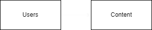

> ## This file will contain all the documentation needed before development
 
 

# Software requirements 
 - Users: 
   -  Multiple user support with it's own content
- Authentication
  - Must be based on JWT standards
  
- Content types for each regular user: 
  - selling products
  - products review
  - buyed products
  - Role (must be 1 for admin and 2 for regular user)

- Admins
    - Will have access to all regular users content
  
# Software Architecture 
> Note: this is not completed yet, just for structure purposes

